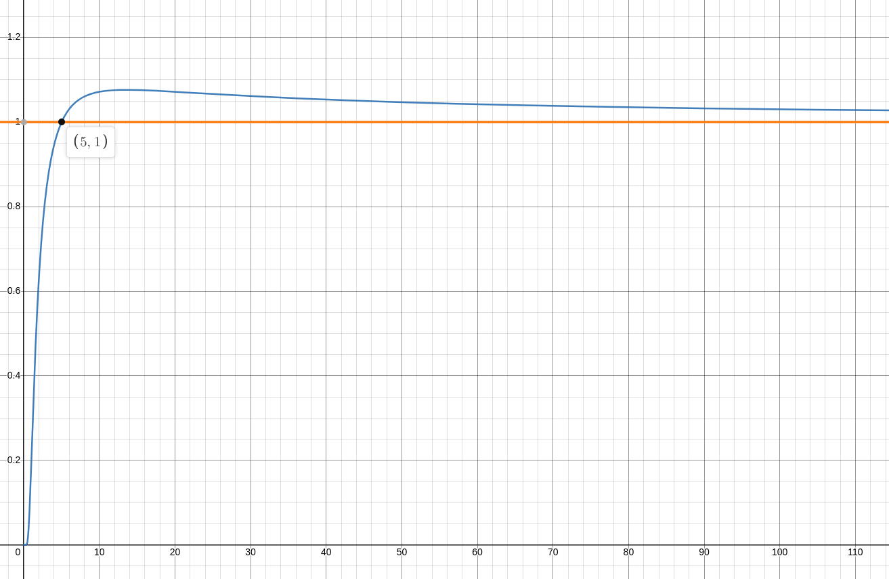

# Implementing prime number factory (Willans' Formula).

## Usage

```bash
make

./main
```

## About

This is a simple implementation of Willans' Formula for calculating the `nth` prime number.

## Math

Willans' Formula is defined as:


$$f(n) = 1 + \sum_{i=1}^{2^n} \left\lfloor \left(\frac{n}{\sum_{j=1}^{i} \left\lfloor \left(\cos \pi \frac{(j - 1)! + 1}{j}\right) ^ 2 \right\rfloor} \right) ^ \frac{1}{n} \right\rfloor
$$

### Separete parts description
Inner part of the sum gives you a pattern where result for prime number *j* is *integer* and for non-prime number *j* is *fraction*:

$$\frac{(j - 1)! + 1}{j}$$

The formula comes from Wilson Theorem, that states that for a natural number *j* bigger than 1, *j* is a prime number if and only if the product of all the positive integers less than *j* is one less than a multiple of *j*:
$$(j-1)! = (j-1)(\bmod j)$$
It means, that j is a prime number if $(f - 1)! + 1$ can be devided by $j$ without a remainder. It can be called a detector for prime numbers. It can be summed up in the schema:

$$
\frac{(j - 1)! + 1}{j} \;is
\begin{cases}
an \;integer & \quad \text{when $j$ is prime or $1$}\\ 
not \; and\; integer & \quad \text{when $j$ is composite}
\end{cases}
$$

Result for first 10 numbers:

| $$j$$ | $$\frac{(j - 1)! + 1}{j}$$ | $$approximation$$ |
| :---: | :------------------------: | :---------------: |
|   1   |             2              |         2         |
|   2   |             1              |         1         |
|   3   |             1              |         1         |
|   4   |      $$\frac{7}{4}$$       |       1.75        |
|   5   |             5              |         5         |
|   6   |     $$\frac{121}{6}$$      |      20.1667      |
|   7   |            103             |        103        |
|   8   |     $$\frac{5041}{8}$$     |      630.125      |
|   9   |    $$\frac{40321}{9}$$     |      4480.11      |
|  10   |   $$\frac{362881}{10}$$    |      36288.1      |

---
The formula is sufficient for calculating primes with computer, when we can loop through all numbers one by one to get `nth` prime. But you can't possibly calculate everything manually. What we want is a formula that will give us a number that is either $1$ or $0$.

$$
Want \quad
\begin{cases}
1 & \quad \text{when $j$ is prime or $1$}\\ 
0 & \quad \text{when $j$ is composite}
\end{cases}
$$

For that we can use trigonometry function $\cos$ to get a number in range of $[-1, 1]$ and then square it to get a number in range of [0, 1]. Then we can use floor function to get either $1$ or $0$. The final formula is:


$$\left\lfloor \left(\cos\pi \frac{(j - 1)! + 1}{j}\right) ^ 2 \right\rfloor$$

$Let\; x = \frac{(j - 1)! + 1}{j} \Rightarrow \cos \pi x$ has global maximum at $x = 2n$ and global minimum at $x = 2n \pm$ 1, where $n$ is an integer. It means that for every natural number $j$ we will get $1$ when $j$ is even and $0$ when $j$ is odd. 


We get:

$$
\cos\pi \frac{(j - 1)! + 1}{j} \;is
\begin{cases}
\pm1 & \quad \text{when $j$ is prime or $1$}\\ 
(1,-1) & \quad \text{when $j$ is composite}
\end{cases}
$$

Now let us square it to get a number in range of $[0, 1]$.


We get:

$$
\left (\cos\pi \frac{(j - 1)! + 1}{j} \right) ^ 2 \;is
\begin{cases}
1 & \quad \text{when $j$ is prime or $1$}\\ 
[0,1) & \quad \text{when $j$ is composite}
\end{cases}
$$

Now we can round it all down to transform $\cos$ function into discrete function with spikes at integers. 


We get:

$$
\left\lfloor \left (\cos\pi \frac{(j - 1)! + 1}{j} \right) ^ 2 \right\rfloor \;is
\begin{cases}
1 & \quad \text{when $j$ is prime or $1$}\\ 
0 & \quad \text{when $j$ is composite}
\end{cases}
$$

---

Certainly, here's a more readable version of the provided explanation:

---

Now that we have implemented a prime number detector, let's use it to count the prime numbers. We can count the primes in the range \([1, i]\) by summing up all the results of the prime number detector for every number in that range. The formula for counting primes is as follows:

$$
\sum_{j=1}^{i} \left\lfloor \left(\cos(\pi \frac{(j - 1)! + 1}{j})\right)^2 \right\rfloor
$$

For example, when \(i = 10\), we find that there are 4 primes in the range \([1, 10]\): 2, 3, 5, and 7. The calculations are as follows:

$$
\sum_{j=1}^{10} \left\lfloor \left(\cos(\pi \frac{(j - 1)! + 1}{j})\right)^2 \right\rfloor =
\left\lfloor \left(\cos(\pi \frac{(1 - 1)! + 1}{1})\right)^2 \right\rfloor_1 + \\
\left\lfloor \left(\cos(\pi \frac{(2 - 1)! + 1}{2})\right)^2 \right\rfloor_2 + 
\ldots +
\left\lfloor \left(\cos(\pi \frac{(10 - 1)! + 1}{10})\right)^2 \right\rfloor_{10} = \\
\left\lfloor \left(\cos(\pi \frac{1}{1})\right)^2 \right\rfloor_1 +
\left\lfloor \left(\cos(\pi \frac{2}{2})\right)^2 \right\rfloor_2 +
\ldots +
\left\lfloor \left(\cos(\pi \frac{362881}{10})\right)^2 \right\rfloor_{10} = \\
1_1 + 1_2 + 1_3 + 0_4 + 1_5 + 0_6 + 1_7 + 0_8 + 0_9 + 0_{10} = 5
$$

So, there are 5 prime numbers in the range \([1, 10]\). But, considering we can't count $1$, we need to subtract $1$ from the result. So, we found out, that the sole purpose of inner denominator is to count primes. 

$$
\sum_{j=1}^{10} 
\left\lfloor 
    \left(\cos \pi \frac{(j - 1)! + 1}{j}\right) ^ 2 
\right\rfloor = (number \;of \;primes \le i) + 1
$$.

---

On the other hand Willans' Formula is supposed to cumpute end prime and that is basically an inverse function of what we currently have. So, the rest of the formula loops through question is the number of primes in range $[1,i]$ is less than $n$ and returns $1$ if it is `true` and $0$ if it is `false`. The first `false` is our answer.

$$
\left\lfloor
\left(\frac{n}{\sum_{j=1}^{i} \left\lfloor \left(\cos \pi \frac{(j - 1)! + 1}{j}\right) ^ 2 \right\rfloor} \right) ^ \frac{1}{n} 
\right\rfloor
$$

What does this part do? Let's rewrite a formula:
$$
\left\lfloor
\left(\frac{n}{(number \;of \; primes \le i) + 1} \right) ^ \frac{1}{n} 
\right\rfloor
$$

As we remember $n$ is the index of prime we want to find and $i$ is the upper bound of the range, where we count primes. $n$ is set by the user and is static, $i$ is a counter. For better understanding, let's make an example: 
$$
Let \;i = 10 \Rightarrow (number \; of \; primes \le i) + 1 = 5
$$

Let's substitute:

$$
\left\lfloor
\left(\frac{n}{4 + 1} \right) ^ \frac{1}{n} 
\right\rfloor
$$

If we plot the result, we will get:



From the plot, it's evident that the function surpasses 1 when $n = 5$. This observation can also be interpreted as follows:

$$ n \geq (\text{number of primes} \leq i) + 1 \Rightarrow n > (\text{number of primes} \leq i) $$

When we apply the floor function, we get:

$$
\left\lfloor \left(\frac{n}{(\text{number of primes} \leq i) + 1}\right)^{\frac{1}{n}} \right\rfloor =
\begin{cases}
1 & \text{when } n > \text{(number of primes} \leq i) \\
0 & \text{when } n \leq \text{(number of primes} \leq i)
\end{cases}
$$

This simplifies to:

$$
\begin{cases}
1 & \text{when the } n^\text{th \; prime} > i \\
0 & \text{when the } n^\text{th \; prime} \leq i
\end{cases}
$$

Further simplifying, we find that:

$$ n > 4 \text{ when the } n^\text{th \; prime} > 10 \Rightarrow n > 4 \text{ when } i > 10 $$

Let's rearrange the formula to get the final result:
$$
\left\lfloor
\left(\frac{n}{\sum_{j=1}^{i} \left\lfloor \left(\cos \pi \frac{(j - 1)! + 1}{j}\right) ^ 2 \right\rfloor} \right) ^ \frac{1}{n} 
\right\rfloor =
\begin{cases}
1 & \quad \text{when $nth \; prime\; number \gt i$ }\\ 
0 & \quad \text{when $nth \; prime\; number \le i$ }
\end{cases}
$$

---

The last part of the formula is the sum of all the results of the prime number detector for every $i$ in the range \([1, 2^n]\). We need to go that far in order to be certain that we are past $nth$ prime. The formula is as follows:
$$
f(n) = 1 + \sum_{i=1}^{2^n} \left\lfloor \left(\frac{n}{\sum_{j=1}^{i} \left\lfloor \left(\cos \pi \frac{(j - 1)! + 1}{j}\right) ^ 2 \right\rfloor} \right) ^ \frac{1}{n} \right\rfloor
$$

Example for $n$ = 4:

$$
f(4) = 1 + \sum_{i=1}^{2^4} \left\lfloor \left(\frac{4}{\sum_{j=1}^{i} \left\lfloor \left(\cos \pi \frac{(j - 1)! + 1}{j}\right) ^ 2 \right\rfloor} \right) ^ \frac{1}{4} \right\rfloor = 1 + 
\left\lfloor 
\left(\frac{4}{\sum_{j=1}^{1} \left\lfloor \left(\cos \pi \frac{(j - 1)! + 1}{j}\right) ^ 2 \right\rfloor} \right) ^ \frac{1}{4} 
\right\rfloor_1 \\ +
\left\lfloor 
\left(\frac{4}{\sum_{j=1}^{2} \left\lfloor \left(\cos \pi \frac{(j - 1)! + 1}{j}\right) ^ 2 \right\rfloor} \right) ^ \frac{1}{4} 
\right\rfloor_2 + \dots + 
\left\lfloor 
\left(\frac{4}{\sum_{j=1}^{16} \left\lfloor \left(\cos \pi \frac{(j - 1)! + 1}{j}\right) ^ 2 \right\rfloor} \right) ^ \frac{1}{4} 
\right\rfloor_{16}
$$

Which is equal to: $1 + 1_1 + 1_2 + .. 1_6 + 0_7 + 0_8 + ... 0_{16} = 7$. And here is our answer: $7$ is the $4th$ prime number.

---

Offshot: Bertrand's Postulate can be expressed as a logical expression as follows:

For every integer $m \ge 2$, there exists a prime number $p$ such that $m < p < 2m$.

In logical notation, it can be written as:

$$
\forall m \geq 2, \exists p, \text{ where } m < p < 2m
$$

Since $2$ is prime itself, Postulate gurantees that there is at least $n$ primes in range $[1, 2^n]$. It means that we can use $2^n$ as an upper bound for $i$ in Willans' Formula. In reality the $nth$ prime number is much smaller than $2^n$ and there is a space for improvement, but it's clear that Willans wasn't very concerned about efficiency.

The method iteself is basically useless, the interesting part is application of basic arithmetic and trigonometry to solve a problem that is usually solved with complex algorithms.

Let's calculate algorithm complexity:
1. From the beginning formula calculates $\left(\cos \pi \frac{(j - 1)! + 1}{j}\right) ^ 2$ for $j$ in range $[1, i]$. It's a constant operation, so it's complexity is $O(1)$.

2. The next inner part calculates \(\sum_{j=1}^{i} \left\lfloor \left(\cos \pi \frac{(j - 1)! + 1}{j}\right) ^ 2 \right\rfloor\) for each \(i\). The sum involves \(i\) terms, and calculating this sum for each \(i\) from 1 to \(2^n\) will have a time complexity of \(O(2^n)\) in the worst case.

3. The expression \(\frac{n}{\sum_{j=1}^{i} \left\lfloor \left(\cos \pi \frac{(j - 1)! + 1}{j}\right) ^ 2 \right\rfloor}\) is calculated for each \(i\) and then raised to the power of \(\frac{1}{n}\). These are also \(O(1)\) operations.

4. The outer sum involves \(2^n\) terms. Therefore, the overall time complexity of the algorithm can be approximated as \(O(2^n)\).

So, the algorithm has an exponential time complexity in terms of \(n\), which means it can become very slow for large values of \(n\). It's worth noting that this complexity is based on the mathematical expressions and not on traditional algorithmic operations. In practice, the actual execution time will depend on the specific implementation and the efficiency of the underlying hardware and software.

Let's code it.